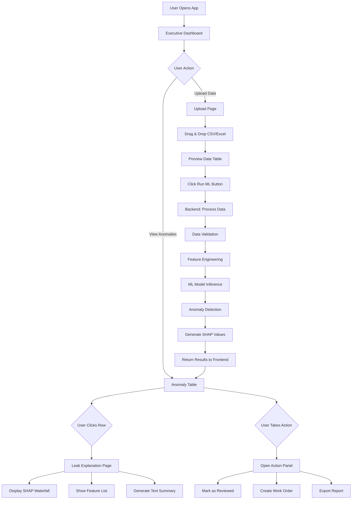

# Leak Detector - Wireframes & System Flow

## 📊 Wireframe Overview

This folder contains 5 core wireframes for the leak detection application:

1. **01-executive-dashboard.png** - Main dashboard with KPIs and metrics
2. **02-anomaly-table.png** - Anomaly detection results table view
3. **03-upload-page.png** - Data upload and ML processing interface
4. **04-leak-explanation.png** - SHAP-based feature explanation page
5. **05-action-panel.png** - Action panel slide-over component

---

## 🔄 System Schematic Flow



---

## 🏗️ Backend Architecture

### Core Components

#### 1. **API Layer** (FastAPI/Flask)
- RESTful endpoints for frontend communication
- File upload handling
- Authentication & authorization
- Request validation

#### 2. **Data Processing Pipeline**
- CSV/Excel file parsing
- Data validation and cleaning
- Feature extraction
- Data normalization

#### 3. **ML Service**
- Pre-trained model loading
- Inference engine
- Anomaly scoring
- SHAP explainability computation

#### 4. **Database Layer**
- Store uploaded datasets
- Cache ML results
- User action logs
- Historical anomaly records

#### 5. **Business Logic**
- Anomaly threshold rules
- Alert generation
- Report generation
- Work order creation

---

## 🔌 API Endpoints Specification

### 1. Dashboard Endpoints

```
GET /api/dashboard/metrics
Response: {
  "total_samples": 1500,
  "anomalies_detected": 23,
  "accuracy_rate": 0.94,
  "last_updated": "2025-11-24T19:47:00Z"
}
```

### 2. Upload & Processing

```
POST /api/upload
Body: FormData with file
Response: {
  "upload_id": "uuid-123",
  "filename": "water_data.csv",
  "rows": 1500,
  "columns": 12,
  "preview": [...first 10 rows...]
}

POST /api/process/{upload_id}
Response: {
  "job_id": "job-456",
  "status": "processing"
}

GET /api/process/status/{job_id}
Response: {
  "status": "completed",
  "progress": 100,
  "anomalies_found": 23,
  "processing_time": 2.3
}
```

### 3. Anomaly Detection Results

```
GET /api/anomalies?upload_id={id}&page=1&limit=20
Response: {
  "total": 23,
  "page": 1,
  "data": [
    {
      "id": "anomaly-1",
      "timestamp": "2025-11-20T10:30:00Z",
      "anomaly_score": 0.87,
      "location": "Zone A - Pipe 12",
      "severity": "high",
      "status": "unreviewed"
    },
    ...
  ]
}
```

### 4. Explainability

```
GET /api/explain/{anomaly_id}
Response: {
  "anomaly_id": "anomaly-1",
  "shap_values": {
    "flow_rate": 0.45,
    "pressure": 0.32,
    "temperature": -0.12,
    ...
  },
  "feature_values": {
    "flow_rate": 145.2,
    "pressure": 82.1,
    ...
  },
  "summary": "High flow rate combined with elevated pressure indicates potential leak..."
}
```

### 5. Actions

```
POST /api/anomalies/{id}/action
Body: {
  "action_type": "mark_reviewed" | "create_work_order" | "export"
  "notes": "Optional notes"
}
Response: {
  "success": true,
  "action_id": "action-789"
}
```

---

## 📦 Data Flow Sequence

### Upload Flow
1. **Frontend**: User drops file → Preview shown → Clicks "Run ML"
2. **Backend**: Receives file → Validates format → Stores in temp storage
3. **Backend**: Starts async processing job → Returns job_id
4. **Frontend**: Polls `/api/process/status/{job_id}` every 2 seconds
5. **Backend**: Processing completes → Updates job status
6. **Frontend**: Redirects to Anomaly Table with results

### Explanation Flow
1. **Frontend**: User clicks anomaly row in table
2. **Backend**: Receives anomaly_id → Fetches from database
3. **Backend**: Computes SHAP values (if not cached)
4. **Backend**: Generates text summary using template/LLM
5. **Frontend**: Renders waterfall chart, features, and summary

---

## 🎯 Development Strategy: Frontend vs Backend First?

### ⚡ **Recommended: Backend-First Development**

**Why Backend First?**

1. **Data Contract Definition** - Establish API contracts early so frontend knows exactly what to expect
2. **ML Model Integration** - Core value is in the ML model; get it working first
3. **Testing & Validation** - Easier to test backend logic independently with tools like Postman/Thunder Client
4. **Parallel Development** - Frontend can use mock data based on API specs while backend develops real implementation

### 📋 **Suggested Development Order**

#### Phase 1: Backend Foundation (Week 1)
```
✓ Set up FastAPI/Flask project structure
✓ Implement file upload endpoint
✓ Create data validation pipeline
✓ Integrate ML model for basic inference
✓ Test with sample data
```

#### Phase 2: Backend Features (Week 2)
```
✓ Add database layer (PostgreSQL/SQLite)
✓ Implement anomaly detection endpoints
✓ Add SHAP explainability computation
✓ Create dashboard metrics endpoint
✓ Add authentication (optional for MVP)
```

#### Phase 3: Frontend Development (Week 3)
```
✓ Set up React/Vue project
✓ Build upload page connecting to backend
✓ Create anomaly table with real API data
✓ Implement dashboard with metrics
✓ Build explanation page with SHAP viz
```

#### Phase 4: Integration & Polish (Week 4)
```
✓ Connect all frontend components to backend
✓ Add loading states and error handling
✓ Implement action panel functionality
✓ End-to-end testing
✓ Performance optimization
```

### 🔄 **Alternative: Hybrid Approach**

For **solo developers** or **small teams**, consider:

1. **Define API contracts** (using OpenAPI/Swagger)
2. **Build frontend with mock data** (matching API contract)
3. **Develop backend** (implementing the contract)
4. **Integrate** (swap mocks for real API calls)

This allows you to:
- Visualize the UX early
- Iterate on design quickly
- Have clear backend requirements
- Avoid backend rework

---

## 🛠️ Technology Stack Recommendations

### Backend
- **Framework**: FastAPI (Python) - async, fast, auto-docs
- **ML**: scikit-learn, XGBoost, SHAP
- **Database**: PostgreSQL (production) or SQLite (MVP)
- **File Storage**: Local filesystem or S3
- **Task Queue**: Celery (for async processing)

### Frontend
- **Framework**: React or Vue.js
- **Charts**: Chart.js or Recharts for line charts
- **Tables**: TanStack Table (React Table)
- **SHAP Viz**: D3.js or Plotly
- **State**: React Query for API caching

---

## 📝 Next Steps

1. **Review wireframes** - Ensure all stakeholders agree on UI flow
2. **Finalize API contracts** - Document all endpoints with request/response formats
3. **Set up backend project** - Initialize FastAPI/Flask with basic structure
4. **Integrate ML model** - Load and test your anomaly detection model
5. **Build MVP endpoints** - Upload, process, and results endpoints
6. **Create frontend** - Build pages connecting to backend APIs

---

## 📌 Quick Reference

| Page | Primary Backend Endpoint | Key Data |
|------|-------------------------|----------|
| Executive Dashboard | `GET /api/dashboard/metrics` | KPIs, stats, recent anomalies |
| Upload Page | `POST /api/upload`, `POST /api/process/{id}` | File handling, job status |
| Anomaly Table | `GET /api/anomalies` | Paginated anomaly list |
| Leak Explanation | `GET /api/explain/{id}` | SHAP values, feature data |
| Action Panel | `POST /api/anomalies/{id}/action` | Action logging |

---

**Created**: November 24, 2025  
**Purpose**: Guide backend development and establish system flow for leak detection application
